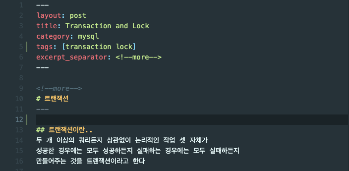

# 블로그 이용

## 다운로드 & 실행
### 다운로드
- 자신의 local 환경에 `git clone` 
   ```
   $ git clone https://github.com/Spring-Study-20210220/Spring-Study-20210220.github.io.git
   ```

### 실행
- local 환경에서 서버 띄워서 적용 내용 확인하기
  ```
  $ bundle exec jekyll serve
  ```

> ✔️  사용중인 ide md preview랑 차이가 있을 수 있으니 확인을 꼭 해야함


## 포스트
### 포스트 작성
1. `git pull`을 함으로써 최신 상태로 만든다
2. `_posts` 하위에 `<year>-<month>-<day>-<제목>.md` 형식으로 파일을 생성한다
    ```
    _posts
      |
      |--- 2021-10-31-title.md
    ```
3. 작성을 마쳤다면 `git push`


### 포스트에 추가 설정
> 💡  포스트.md 생성시 최상단에 아래의 사진과 같이 배치하면 된다


- **layout** : 해당 페이지의 외향을 결정하는 것인데 `post`를 사용하면 된다
- **title** : 포스트의 제목을 설정하는 부분이다
- **category** : 포스트의 카테고리를 설정한다 여러개를 적용할 수 있지만 **1개 사용을 권장한다**
- **tags** : 포스트에 원하는 태그를 작성할 수 있다
  ```
  사진에는 ,가 빠졌는데 넣어주면 된다
  예) tags: [transaction, lock, ...]
  ```
- **excerpt_separator** : preview를 어디까지 보여줄지 원하는 키워드로 표시 할 수 있다

### 미완성 포스트인 경우
- `_drafts` 하위에 `제목.md` 으로 저장하면 된다


### 포스트 이미지 첨부
1. `/assets/img/post-image` 하위에 해당하는 카테고리가 있다면 사용 아니라면 생성 뒤 하위에 저장 한다 
2. 마크다운 내부에 `` 형식으로 작성하면 되지만 url 부분에 절대 경로가 들어가야 된다
    ```
    예) 

    site : liquid template 객체로써 블로그에 대한 정보를 담고있다
    ```
